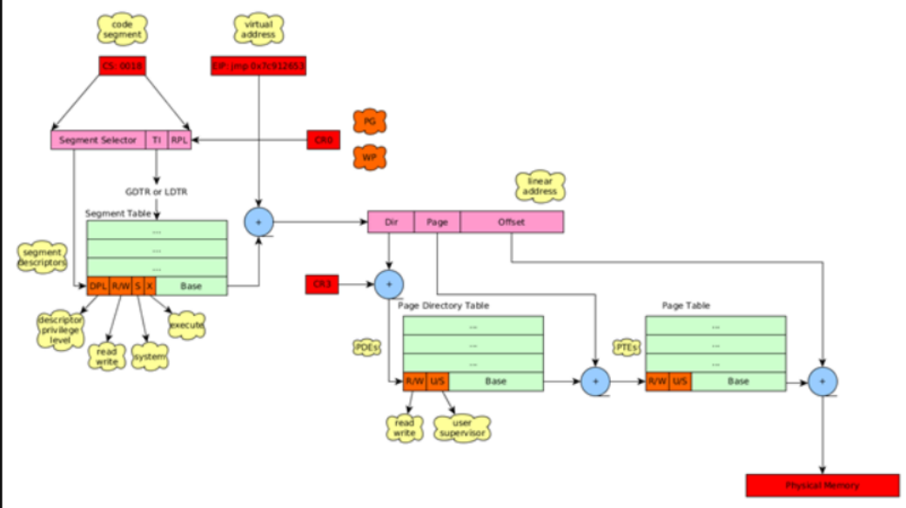

# Chrome

- ULONG

```c++
#if defined(_WIN64) //64位
    typedef __int64 			INT_PTR, *PINT_PTR;
    typedef unsigned __int64 	UINT_PTR, *PUINT_PTR;
    typedef __int64 			LONG_PTR, *PLONG_PTR;
    typedef unsigned __int64 	ULONG_PTR, *PULONG_PTR;
#else //32位
    typedef _W64 int 			INT_PTR, *PINT_PTR;
    typedef _W64 unsigned int 	UINT_PTR, *PUINT_PTR;
    typedef _W64 long 			LONG_PTR, *PLONG_PTR;
    typedef _W64 unsigned long 	ULONG_PTR, *PULONG_PTR;
#endif

//然后void* 其本身这个数据类型就支持32bit 64bit的CPU
char v1[11] = "HelloWolrd";
void* p1 = &v1;
int v2 = sizeof(p1); //32bit-->4   64bit--->8

//Windows仅仅有的包装是
typedef void *PVOID;
typedef void * POINTER_64 PVOID64; //本类型就是32位下的指针都是8字节宽度
```

**总结：**意思就是DATA__PTR的数据类型支持x86和x64两种结构。

- SSDT

系统进入内核时候，对应的服务号由eax传入，但是传入的是一个32位的数。所以不可能所有的位都用于索引记录，故不同位的意义如下。

- bits 0-11: the system service number (SSN) to be invoked.
- bits 12-13: the service descriptor table (SDT). //0x00--->KeServiceDescriptorTable  0x01--->KeServiceDescriptorTableShadow
- bits 14-31: not used.

Every System service table contains the flowing fields:

- ServiceTable: points to an array of virtual addresses – the SSDT (System Service Dispatch Table), where each entry further points to a kernel routine.
- CounterTable: not used.
- ServiceLimit: number of entries in the SSDT table.
- ArgumentTable: points to an array of bytes – the SSDP (System Service Parameter Table), where each byte represents the number of bytes allocated for function arguments for corresponding with each SSDT routine.




- NtCurrentProcess

Returns a handle to a current process.

- RtlImageNtHeader

```c
PIMAGE_NT_HEADERS NTAPI RtlImageNtHeader(PVOID BaseAddress);
//BaseAddress
//Is a module base address in process virtual memory, known as HMODULE.
```

Undocumented API, retuens a pointer to IMAGE_NT_HEADER structure.

****

## Reference

1. [Hooking System Service Descriptor Table](https://resources.infosecinstitute.com/topic/hooking-system-service-dispatch-table-ssdt/)
2. 
